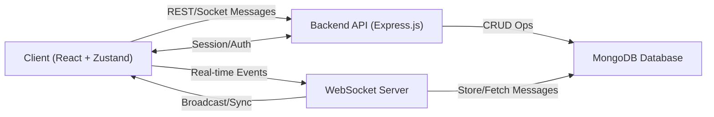
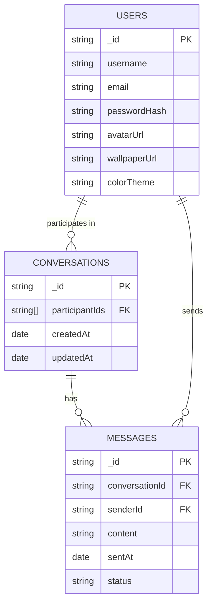
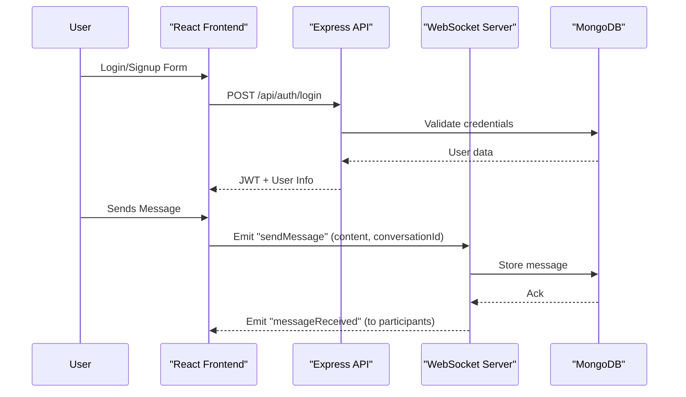
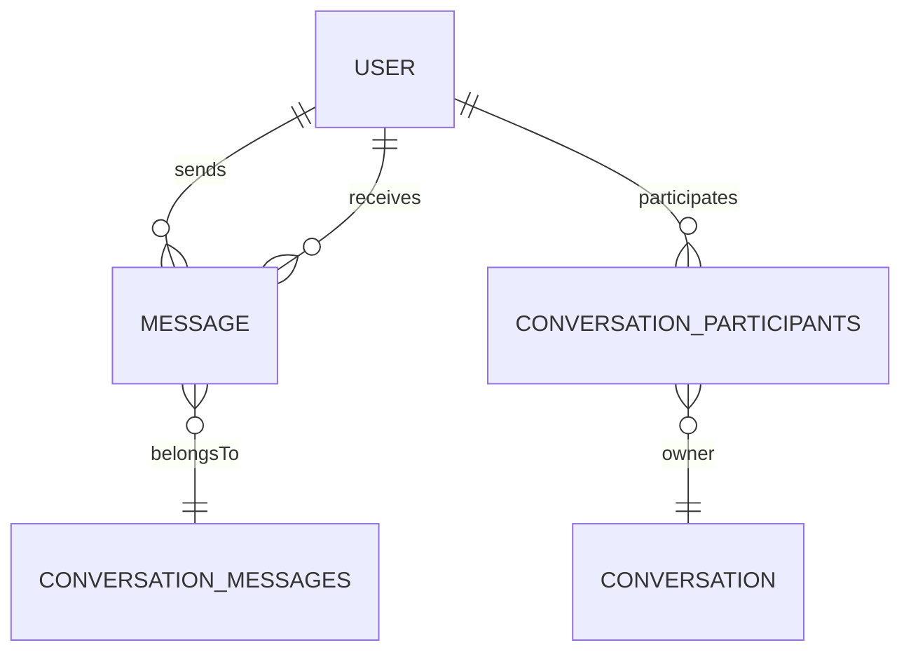

# 🙏 NamasteChat

A modern, real-time chat application leveraging the power of **React**, **Node.js**, **Express**, **MongoDB**, and **Zustand** for seamless state management. NamasteChat offers a clean, customizable chat experience inspired by today’s top messaging platforms, blending robust real-time features with a highly responsive and intuitive UI.


## 📸 Screenshots


---

## 📚 Index

1. [Features](#-features)
2. [Tech Stack](#️-tech-stack)
3. [Architecture Overview](#-architecture-overview)
4. [Data Model](#-data-model)
5. [State Management](#-state-management)
6. [API Flow](#-api-flow)
7. [Getting Started](#-getting-started)
8. [Customization Options](#-customization-options)
9. [Contributing](#-contributing)
10. [License](#-license)

---

## ✨ Features

| Feature                           | Description                                                                                           |
|------------------------------------|-------------------------------------------------------------------------------------------------------|
| ✅ Real-Time Messaging             | Instantly exchange messages between users using WebSockets.                                            |
| ✅ Dynamic Conversations           | Conversations are auto-created on first contact, streamlining new connections.                        |
| ✅ Customizable Chat Experience    | Users can upload wallpapers, adjust message bubble colors, and preview chat appearance responsively.   |
| ✅ User Authentication             | Secure login and signup flows protect your messaging data.                                            |
| ✅ Mobile & Desktop Responsive     | Fluid UI adapts perfectly to all device sizes.                                                        |
| ✅ Modern UI                       | Built with Tailwind CSS and DaisyUI for a polished look and feel.                                     |

---

## 🛠️ Tech Stack

| Layer       | Technologies                            |
|-------------|-----------------------------------------|
| Frontend    | React, Tailwind CSS, DaisyUI            |
| State Mgmt  | Zustand                                 |
| Backend     | Node.js, Express.js                     |
| Database    | MongoDB (Mongoose ODM)                  |
| Icons       | React Icons                             |

---

## 🏗️ Architecture Overview

NamasteChat follows a modern, decoupled architecture:



- **Frontend** handles UI, user actions, and state.
- **Backend** exposes REST APIs for authentication, conversations, and user management.
- **WebSocket Server** enables real-time bi-directional communication for messages.
- **MongoDB** persists users, chat history, and settings.

---

## 🗃️ Data Model

NamasteChat leverages MongoDB with Mongoose schemas for users, conversations, and messages.

### Entity Relationship Overview



---

## 🗃️ State Management

NamasteChat uses **Zustand** for fast, scalable state management in React.

### Core State Slices

- **Auth Store**: Current user, token, login state
- **Chat Store**: Current conversations, active chat, message list
- **UI Store**: Theme, wallpaper, and customization preferences

---

## 📲 API Flow

### Authentication & Messaging Sequence



---

## 🚀 Getting Started

> **Note:** Make sure you have **Node.js** and **MongoDB** installed locally.

### 1️⃣ Clone the repository

```bash
git clone https://github.com/Riteshmaurya1/NamasteChat-.git
cd NamasteChat-
```

### 2️⃣ Install dependencies

```bash
# Frontend
cd client
npm install

# Backend
cd ../server
npm install
```

### 3️⃣ Configure environment variables

- **Frontend:** Edit `client/.env` for API and WebSocket URLs.
- **Backend:** Edit `server/.env` for your MongoDB URI, JWT secret, etc.

### 4️⃣ Start the servers

```bash
# In separate terminals

# Start backend
cd server
npm run dev

# Start frontend
cd ../client
npm start
```

### 5️⃣ Access the app

- Visit http://localhost:3000 in your browser.

---

## 🎨 Customization Options

- **Chat Wallpaper:** Upload your own background for chat.
- **Bubble Colors:** Select unique colors for your message bubbles.
- **Responsive Preview:** Instantly preview your chat appearance as you customize.

---

## 🤝 Contributing

1. Fork this repo and create your branch:
   ```bash
   git checkout -b feature/YourFeature
   ```
2. Commit your changes and push:
   ```bash
   git commit -m 'Add feature'
   git push origin feature/YourFeature
   ```
3. Create a Pull Request describing your feature/bugfix.

---

## 📄 License

[MIT License](LICENSE)

---

Namaste 🙏 and Happy Chatting!


## 📄 📚 Project Documentation
# 📚 Project Documentation

This document provides **detailed** insights into the selected files from both the **server** and **client** sides of the repository. It covers their purposes, content, and inter-relationships.  
An **Entity-Relationship Diagram** for the database models illustrates the data structure relationships.

---

## Table of Contents

- [Server](#server)  
  - [Configuration](#configuration)  
    - `server/config/dbConnection.js`  
  - [Controllers](#controllers)  
    - `server/controllers/User.js`  
    - `server/controllers/MessageController.js`  
  - [JWT Utility](#jwt-utility)  
    - `server/jwt/generatesToken.js`  
  - [Middleware](#middleware)  
    - `server/middleware/auth.js`  
  - [Models](#models)  
    - `server/models/Userdb.js`  
    - `server/models/Messagedb.js`  
    - `server/models/ConversationMessagedb.js`  
    - **ER Diagram**  
  - [Routes](#routes)  
    - `server/routes/Route.js`  
    - `server/routes/MessageRoute.js`  
  - [Entry Point](#entry-point)  
    - `server/server.js`  
  - [Dependencies](#dependencies)  
    - `server/package.json`  

- [Client](#client)  
  - [Assets](#assets)  
    - `client/src/assets/images.js`  
  - [Components](#components)  
    - `client/src/components/BottomSearch.jsx`  
    - `client/src/components/CustomToast.jsx`  
    - `client/src/components/Loading.jsx`  
    - `client/src/components/MessageBubble.jsx`  
    - `client/src/components/Navbar.jsx`  
  - [Context & Hooks](#context--hooks)  
    - `client/src/context/AppContext.jsx`  
    - `client/src/context/AppProvider.jsx`  
    - `client/src/context/useGetMessage.js`  
    - `client/src/context/useSendMessage.js`  
  - [State Management](#state-management)  
    - `client/src/statemanage/useConversation.js`  
  - [Pages & Layout](#pages--layout)  
    - `client/src/landing/LandingPage.jsx`  
    - `client/src/pages/Login.jsx`  
    - `client/src/pages/Register.jsx`  
    - `client/src/pages/Profile.jsx`  
    - `client/src/home/Home.jsx`  
      - `client/src/home/aside/AsideSearch.jsx`  
      - `client/src/home/aside/Aside.jsx`  
      - `client/src/home/chat/Chat.jsx`  
  - [Application Bootstrap](#application-bootstrap)  
    - `client/src/App.jsx`  
    - `client/src/main.jsx`  
    - `client/index.html`  
  - [Configuration](#configuration-client)  
    - `client/src/tailwind.config.js`  
    - `client/eslint.config.js`  
    - `client/package.json`  
    - `client/vite.config.js`  

---

## Server

### Configuration

#### `server/config/dbConnection.js`

Connects to MongoDB using Mongoose and environment variables.

```js
import mongoose from "mongoose";
import dotenv from "dotenv";
dotenv.config();

const dbConnection = () => {
  mongoose
    .connect(process.env.MONGODB_URI, { dbName: "Users" })
    .then(() => console.log("Connected to MongoDB ✔"))
    .catch(err => console.log("Error connecting to MongoDB ❌", err));
};

export default dbConnection;
```

- Loads `MONGODB_URI` from `.env`.  
- Specifies the database name `Users`.

---

### Controllers

#### `server/controllers/User.js`

Handles **registration**, **login**, **logout**, and user retrieval.

```js
import Userdb from "./models/Userdb.js";
import bcrypt from "bcrypt";
import createTokenAndSaveCookie from "./jwt/generatesToken.js";

export const register = async (req, res) => { /* ... */ };
export const login    = async (req, res) => { /* ... */ };
export const logout   = async (req, res) => { /* ... */ };
export const getUserProfile = async (req, res) => { /* ... */ };
export const Profile  = async (req, res) => { /* ... */ };
```

Key flows:  
- **Registration**: check existing email, validate passwords, hash with bcrypt, save user, issue JWT cookie.  
- **Login**: validate credentials, compare passwords, issue JWT cookie.  
- **Logout**: clear JWT cookie.  
- **getUserProfile**: return all users except the logged-in one.  
- **Profile**: return only the logged-in user’s `name` and `email`.

---

#### `server/controllers/MessageController.js`

Manages **sending** and **retrieving** chat messages.

```js
import Conversation from "../models/ConversationMessagedb.js";
import Message      from "../models/Messagedb.js";

export const sendMessage = async (req, res) => { /* ... */ };
export const getMessages = async (req, res) => { /* ... */ };
```

Flow for **sendMessage**:  
1. **Authenticate** via `req.user`.  
2. Find or **create** a `Conversation` between sender & receiver.  
3. Save a new `Message`, append reference to the `Conversation`.  
4. Respond with the saved message.

Flow for **getMessages**:  
1. Look up the `Conversation` for the two users.  
2. Populate `messages` array and return.

---

### JWT Utility

#### `server/jwt/generatesToken.js`

Creates a JWT and sets it as an HTTP-only cookie.

```js
import jwt from "jsonwebtoken";

const createTokenAndSaveCookie = (userId, res) => {
  const token = jwt.sign({ userId }, process.env.SECRET_KEY, { expiresIn: "7d" });
  res.cookie("jwt", token, {
    httpOnly: true,
    secure: process.env.NODE_ENV === "production",
    sameSite: "strict",
  });
  return token;
};

export default createTokenAndSaveCookie;
```

---

### Middleware

#### `server/middleware/auth.js`

Protects routes by verifying the JWT and attaching the user to the request.

```js
import jwt  from "jsonwebtoken";
import User from "../models/Userdb.js";

export const protect = async (req, res, next) => {
  try {
    const token = req.cookies.jwt;
    if (!token) return res.status(401).json({ message: "Unauthorized" });

    const { userId } = jwt.verify(token, process.env.SECRET_KEY);
    const user = await User.findById(userId).select("-password");
    if (!user) return res.status(401).json({ message: "User not found" });

    req.user = user; 
    next();
  } catch (error) {
    res.status(500).json({ message: "Internal Server Error" });
  }
};
```

---

### Models

#### `server/models/Userdb.js`

```js
import mongoose from "mongoose";

const userSchema = new mongoose.Schema({
  name:     { type: String, required: true },
  email:    { type: String, required: true, unique: true },
  password: { type: String, required: true },
  createAt: { type: Date, default: Date.now },
});

export default mongoose.model("User", userSchema);
```

#### `server/models/Messagedb.js`

```js
import mongoose from "mongoose";

const messageSchema = new mongoose.Schema({
  sender:   { type: mongoose.Schema.Types.ObjectId, ref: "User", required: true },
  receiver: { type: mongoose.Schema.Types.ObjectId, ref: "User", required: true },
  message:  { type: String, required: true, maxLength: 1000, trim: true, validate: [ { validator: v => v.length > 0, message: "Message can't be empty"} ] },
  createdAt:{ type: Date, default: Date.now },
}, { timestamps: true });

export default mongoose.model("Message", messageSchema);
```

#### `server/models/ConversationMessagedb.js`

```js
import mongoose from "mongoose";

const conversationSchema = new mongoose.Schema({
  participants: [{ type: mongoose.Schema.Types.ObjectId, ref: "User" }],
  messages:     [{ type: mongoose.Schema.Types.ObjectId, ref: "Message", default: [] }],
}, { timestamps: true });

export default mongoose.model("Conversation", conversationSchema);
```

---

#### ER Diagram



- **USER**  
- **MESSAGE** (links sender & receiver)  
- **CONVERSATION** (references participants and messages)

---

### Routes

#### `server/routes/Route.js`

```js
import express from "express";
import { register, login, logout, getUserProfile, Profile } from "../controllers/User.js";
import { protect } from "../middleware/auth.js";

const router = express.Router();
router.post("/register", register);
router.post("/login",    login);
router.post("/logout",   logout);
router.get("/getuserprofile", protect, getUserProfile);
router.get("/profile",        protect, Profile);

export default router;
```

#### `server/routes/MessageRoute.js`

```js
import express from "express";
import { sendMessage, getMessages } from "../controllers/MessageController.js";
import { protect } from "../middleware/auth.js";

const router = express.Router();
router.post("/send/:id", protect, sendMessage);
router.get("/get/:id",   protect, getMessages);

export default router;
```

---

### Entry Point

#### `server/server.js`

```js
import express from "express";
import { config } from "dotenv";
import bodyParser  from "express";
import cors        from "cors";
import cookieParser from "cookie-parser";

import dbConnection from "./config/dbConnection.js";
import userRouter   from "./routes/Route.js";
import msgRouter    from "./routes/MessageRoute.js";

config();
const app = express();
const PORT = process.env.PORT || 3000;

app.use(bodyParser.json());
app.use(express.json());
app.use(cookieParser());
app.use(express.urlencoded({ extended: true }));
app.use(cors({ origin: "http://localhost:5173", credentials: true }));

app.use("/api/user",    userRouter);
app.use("/api/message", msgRouter);
app.get("/", (req, res) => res.send("Backend is running"));

dbConnection();
app.listen(PORT, () => console.log(`Server running on port ${PORT}`));
```

---

### Dependencies

#### `server/package.json`

```json
{
  "name": "server",
  "version": "1.0.0",
  "type": "module",
  "scripts": { "start": "nodemon server.js" },
  "dependencies": {
    "bcrypt": "^6.0.0",
    "cookie-parser": "^1.4.7",
    "cors": "^2.8.5",
    "dotenv": "^17.0.0",
    "express": "^5.1.0",
    "jsonwebtoken": "^9.0.2",
    "mongoose": "^8.16.1"
  }
}
```

---

## Client

### Assets

#### `client/src/assets/images.js`

Exports static images for use across pages/components.

```js
import landingImg from "./landingImg.png";
import chat1       from "./chat1.png";
import chat2       from "./chat2.png";
import chat3       from "./chat3.png";
import chat4       from "./chat4.png";
import chat5       from "./chat5.png";
import bg          from "./bg.png";

export { landingImg, chat1, chat2, chat3, chat4, chat5, bg };
```

---

### Components

#### `BottomSearch.jsx`

Footer chat input with send, attach, and voice icons.

```jsx
import React, { useState } from "react";
import { BsFillSendFill } from "react-icons/bs";
import { MdOutlineAddPhotoAlternate } from "react-icons/md";
import { FiLink } from "react-icons/fi";
import { RiVoiceAiFill } from "react-icons/ri";
import useSendMessage from "../context/useSendMessage";

const BottomSearch = () => {
  const [newMessage, setNewMessage] = useState("");
  const { sendMessage, loading } = useSendMessage();

  const handleSend = async () => {
    if (!newMessage.trim()) return;
    await sendMessage(newMessage);
    setNewMessage("");
  };

  return (
    <div className="w-full bg-transparent p-2">
      <div className="flex items-center gap-2 max-w-4xl mx-auto bg-white rounded-2xl shadow p-2">
        <button className="hidden md:flex p-3 bg-gray-700 text-white rounded-xl">
          <FiLink />
        </button>
        <button className="p-3 bg-gray-700 text-white rounded-xl">
          <MdOutlineAddPhotoAlternate />
        </button>
        <input
          className="flex-1 px-4 py-2 bg-gray-700 text-white rounded-full focus:outline-none"
          type="text"
          placeholder="Type your message."
          value={newMessage}
          onChange={e => setNewMessage(e.target.value)}
          onKeyDown={e => e.key === "Enter" && handleSend()}
        />
        <button
          onClick={handleSend}
          disabled={loading}
          className="p-3 bg-gray-700 text-white rounded-xl disabled:opacity-50"
        >
          <BsFillSendFill />
        </button>
        <button className="hidden md:flex p-3 bg-gray-700 text-white rounded-xl">
          <RiVoiceAiFill />
        </button>
      </div>
    </div>
  );
};

export default BottomSearch;
```

---

#### `CustomToast.jsx`

Auto-closing toast notification.

```jsx
import React, { useEffect } from "react";

const CustomToast = ({ message, type = "success", onClose }) => {
  useEffect(() => {
    const timer = setTimeout(onClose, 3000);
    return () => clearTimeout(timer);
  }, [onClose]);

  return (
    <div
      className={`px-4 py-2 mb-2 rounded shadow-lg text-white animate-slideIn ${
        type === "success" ? "bg-green-500" : "bg-red-500"
      }`}
    >
      {message}
    </div>
  );
};

export default CustomToast;
```

---

#### `Loading.jsx`

Centered loading spinner.

```jsx
import React from "react";

const Loading = () => (
  <div className="flex items-center justify-center h-screen bg-[#fcf5eb]">
    <span className="loading loading-ring loading-xl text-black"></span>
  </div>
);

export default Loading;
```

---

#### `MessageBubble.jsx`

Chat message display with dynamic styling.

```jsx
import React from "react";

const MessageBubble = ({ text, isSender, time, bubbleColor }) => {
  const senderBg = {
    green:  "bg-green-700",
    blue:   "bg-blue-600",
    purple: "bg-purple-600",
    pink:   "bg-pink-500",
    gray:   "bg-gray-500",
  }[bubbleColor || "green"];

  return (
    <div className={`flex ${isSender ? "justify-end" : "justify-start"} mb-2`}>
      <div
        className={`max-w-xs px-4 py-2 text-sm rounded-2xl relative ${
          isSender
            ? `${senderBg} text-white rounded-br-none border border-gray-500 pb-3`
            : "bg-white text-black rounded-tl-none border border-gray-100"
        }`}
      >
        {text}
        <div className="absolute bottom-0.5 right-2 flex items-center gap-1">
          <span className="text-[8px] text-gray-200">{time}</span>
          {isSender && (
            <svg className="w-4 h-4 text-blue-700" viewBox="0 0 24 24" fill="currentColor">
              <path d="M1.5 13l4 4L14 8l-1.4-1.4L5.5 13l-2.1-2.1L1.5 13zm6 0l4 4L20 8l-1.4-1.4L13.5 13l-2.1-2.1L7.5 13z" />
            </svg>
          )}
        </div>
      </div>
    </div>
  );
};

export default MessageBubble;
```

---

#### `Navbar.jsx`

Top navigation showing app logo, user actions, and chat title/controls.

```jsx
import React, { useContext } from "react";
import { Link, useNavigate } from "react-router-dom";
import { SearchWaves } from "@mynaui/icons-react";
import { AppContext } from "../context/AppContext";
import useConversation from "../statemanage/useConversation";

const Navbar = () => {
  const { selectedConversation } = useConversation();
  const { logout } = useContext(AppContext);
  const navigate = useNavigate();

  return (
    <div className="w-full flex items-center justify-between p-4 bg-white shadow">
      <div className="flex items-center gap-2">
        
        <span className="text-xl font-bold text-green-500">MyChatApp</span>
      </div>
      <div className="flex items-center gap-4">
        <SearchWaves className="text-gray-700 size-8" />
        <button onClick={() => { logout(); navigate("/login"); }} className="text-red-500">
          Logout
        </button>
      </div>
    </div>
  );
};

export default Navbar;
```

---

### Context & Hooks

#### `client/src/context/AppContext.jsx`

Creates a React context for global app state.

```js
import { createContext } from "react";
export const AppContext = createContext();
```

---

#### `client/src/context/AppProvider.jsx`

Provides authentication, user list, theming, and actions via context.

```jsx
import React, { useState, useEffect } from "react";
import { AppContext } from "./AppContext";
import axios from "axios";
import toast from "react-hot-toast";

export const AppProvider = ({ children }) => {
  const [userInfo, setUserInfo]       = useState(null);
  const [users, setUsers]             = useState([]);
  const [loadingUsers, setLoadingUsers] = useState(true);
  const [profileData, setProfileData] = useState(null);
  const [wallpaper, setWallpaper]     = useState(localStorage.getItem("chatWallpaper") || "");
  const [bubbleColor, setBubbleColor] = useState(localStorage.getItem("bubbleColor") || "green");

  const login = async (email, password, navigate) => { /* ... */ };
  const logout = async () => { /* ... */ };

  useEffect(() => {
    // Fetch all users
    (async () => {
      try {
        const { data } = await axios.get("/api/user/getuserprofile", { withCredentials: true });
        setUsers(data.filteredfUser);
      } catch {
        toast.error("Failed to load users");
      } finally {
        setLoadingUsers(false);
      }
    })();
  }, []);

  useEffect(() => {
    // Fetch own profile
    (async () => {
      try {
        const { data } = await axios.get("/api/user/profile", { withCredentials: true });
        setProfileData(data.profile);
      } catch {
        toast.error("Failed to load profile");
      }
    })();
  }, []);

  return (
    <AppContext.Provider
      value={{ userInfo, login, logout, users, loadingUsers, profileData, wallpaper, setWallpaper, bubbleColor, setBubbleColor }}
    >
      {children}
    </AppContext.Provider>
  );
};
```

---

#### `useGetMessage.js`

Fetches and stores messages for the selected conversation.

```js
import { useState, useEffect } from "react";
import useConversation from "../statemanage/useConversation";
import axios from "axios";

const useGetMessage = () => {
  const [loading, setLoading] = useState(false);
  const { messages, setMessages, selectedConversation } = useConversation();

  useEffect(() => {
    if (!selectedConversation?._id) return;
    setLoading(true);
    axios
      .get(`/api/message/get/${selectedConversation._id}`, { withCredentials: true })
      .then(res => setMessages(res.data))
      .catch(console.error)
      .finally(() => setLoading(false));
  }, [selectedConversation, setMessages]);

  return { messages, loading };
};

export default useGetMessage;
```

---

#### `useSendMessage.js`

Sends a new message and appends it to state.

```js
import { useState } from "react";
import axios from "axios";
import useConversation from "../statemanage/useConversation";

const useSendMessage = () => {
  const [loading, setLoading] = useState(false);
  const { selectedConversation, setMessages } = useConversation();

  const sendMessage = async (text) => {
    if (!selectedConversation?._id) return;
    setLoading(true);
    try {
      const { data } = await axios.post(
        `/api/message/send/${selectedConversation._id}`,
        { message: text },
        { withCredentials: true }
      );
      setMessages(prev => [...(prev || []), data.newMessage]);
    } catch (err) {
      console.error("Send error", err);
    } finally {
      setLoading(false);
    }
  };

  return { sendMessage, loading };
};

export default useSendMessage;
```

---

### State Management

#### `client/src/statemanage/useConversation.js`

Global store via Zustand for current conversation and its messages.

```js
import { create } from "zustand";

const useConversation = create(set => ({
  selectedConversation: null,
  messages:            [],
  setSelectedConversation: conv => set({ selectedConversation: conv }),
  setMessages:            msgs => set({ messages: msgs }),
}));

export default useConversation;
```

---

### Pages & Layout

#### `client/src/landing/LandingPage.jsx`

Hero section with animated chat illustrations and navigation.

#### `client/src/pages/Login.jsx`

Form for user login, storing JWT on success and redirect to `/home`.

#### `client/src/pages/Register.jsx`

User registration form, saving JWT & userId, redirecting to `/login`.

#### `client/src/pages/Profile.jsx`

Allows customizing wallpaper & bubble color, preview on phone mockup, and navigation.

---

#### `client/src/home/Home.jsx`

Main chat layout splitting into:

- **Sidebar** (`AsideSearch` + `Aside`)  
- **Chat area** (`Navbar` + `Chat`)  
- **Footer** (`BottomSearch`)

---

##### `AsideSearch.jsx`

Search input & “Create A Group” button.

##### `Aside.jsx`

Lists all users, highlights the selected one, and updates global conversation state.

##### `Chat.jsx`

Renders messages (grouped by date) and applies theming.

---

### Application Bootstrap

#### `client/src/App.jsx`

Defines routes and protection logic based on presence of JWT in `localStorage`.

```jsx
import { Routes, Route, Navigate } from "react-router-dom";

<Routes>
  <Route path="/"       element={<LandingPage />} />
  <Route path="/login"  element={<Login />} />
  <Route path="/register" element={<Register />} />
  <Route path="/home"   element={token ? <Home /> : <Navigate to="/login" />} />
  <Route path="/profile"element={token ? <Profile /> : <Navigate to="/login" />} />
  <Route path="*"       element={<Navigate to="/" />} />
</Routes>
```

---

#### `client/src/main.jsx`

Renders `<App />` within React Router and `<AppProvider>`.

```jsx
import React from "react";
import ReactDOM from "react-dom/client";
import { BrowserRouter } from "react-router-dom";
import App from "./App.jsx";
import { AppProvider } from "./context/AppProvider.jsx";

ReactDOM.createRoot(document.getElementById("root")).render(
  <BrowserRouter>
    <AppProvider>
      <App />
    </AppProvider>
  </BrowserRouter>
);
```

---

#### `client/index.html`

Base HTML with `<div id="root"></div>` for React.

---

### Configuration (Client)

#### `client/src/tailwind.config.js`

Tailwind CSS setup scanning `src` for classes and including scrollbar plugin.

#### `client/eslint.config.js`

ESLint configuration for React, hooks, and Vite.

#### `client/package.json`

Lists dependencies like React, Axios, Zustand, Tailwind CSS, Framer Motion, etc.

#### `client/vite.config.js`

Vite setup with React SWC plugin and Tailwind integration.

---

# 🎯 Summary of Relationships

- **Server**:  
  - **Routes** invoke **Controllers** → Controllers use **Models** → Models persist to MongoDB.
  - **Middleware** (`auth.js`) protects routes by decoding JWTs created in **generatesToken.js**.

- **Client**:  
  - **AppProvider** manages global state & theming.  
  - **Custom Hooks** (`useGetMessage`, `useSendMessage`) interact with server APIs to fetch/send messages.  
  - **Components** display UI and leverage hooks and context.  
  - **Router** protects pages based on JWT presence.

This modular architecture cleanly separates concerns: configuration, data modeling, business logic, routing, and presentation on both backend and frontend.
