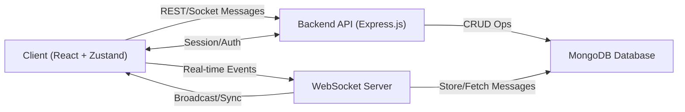
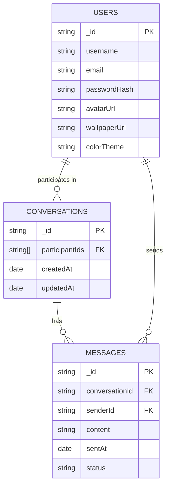
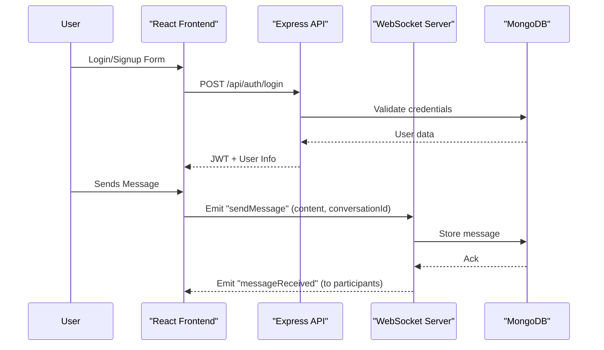

# 🙏 NamasteChat

A modern, real-time chat application leveraging the power of **React**, **Node.js**, **Express**, **MongoDB**, and **Zustand** for seamless state management. NamasteChat offers a clean, customizable chat experience inspired by today’s top messaging platforms, blending robust real-time features with a highly responsive and intuitive UI.


---

## 📚 Index

1. [Features](#-features)
2. [Tech Stack](#️-tech-stack)
3. [Architecture Overview](#-architecture-overview)
4. [Data Model](#-data-model)
5. [State Management](#-state-management)
6. [API Flow](#-api-flow)
7. [Getting Started](#-getting-started)
8. [Customization Options](#-customization-options)
9. [Contributing](#-contributing)
10. [License](#-license)

---

## ✨ Features

| Feature                           | Description                                                                                           |
|------------------------------------|-------------------------------------------------------------------------------------------------------|
| ✅ Real-Time Messaging             | Instantly exchange messages between users using WebSockets.                                            |
| ✅ Dynamic Conversations           | Conversations are auto-created on first contact, streamlining new connections.                        |
| ✅ Customizable Chat Experience    | Users can upload wallpapers, adjust message bubble colors, and preview chat appearance responsively.   |
| ✅ User Authentication             | Secure login and signup flows protect your messaging data.                                            |
| ✅ Mobile & Desktop Responsive     | Fluid UI adapts perfectly to all device sizes.                                                        |
| ✅ Modern UI                       | Built with Tailwind CSS and DaisyUI for a polished look and feel.                                     |

---

## 🛠️ Tech Stack

| Layer       | Technologies                            |
|-------------|-----------------------------------------|
| Frontend    | React, Tailwind CSS, DaisyUI            |
| State Mgmt  | Zustand                                 |
| Backend     | Node.js, Express.js                     |
| Database    | MongoDB (Mongoose ODM)                  |
| Icons       | React Icons                             |

---

## 🏗️ Architecture Overview

NamasteChat follows a modern, decoupled architecture:



- **Frontend** handles UI, user actions, and state.
- **Backend** exposes REST APIs for authentication, conversations, and user management.
- **WebSocket Server** enables real-time bi-directional communication for messages.
- **MongoDB** persists users, chat history, and settings.

---

## 🗃️ Data Model

NamasteChat leverages MongoDB with Mongoose schemas for users, conversations, and messages.

### Entity Relationship Overview



---

## 🗃️ State Management

NamasteChat uses **Zustand** for fast, scalable state management in React.

### Core State Slices

- **Auth Store**: Current user, token, login state
- **Chat Store**: Current conversations, active chat, message list
- **UI Store**: Theme, wallpaper, and customization preferences

---

## 📲 API Flow

### Authentication & Messaging Sequence



---

## 🚀 Getting Started

> **Note:** Make sure you have **Node.js** and **MongoDB** installed locally.

### 1️⃣ Clone the repository

```bash
git clone https://github.com/Riteshmaurya1/NamasteChat-.git
cd NamasteChat-
```

### 2️⃣ Install dependencies

```bash
# Frontend
cd client
npm install

# Backend
cd ../server
npm install
```

### 3️⃣ Configure environment variables

- **Frontend:** Edit `client/.env` for API and WebSocket URLs.
- **Backend:** Edit `server/.env` for your MongoDB URI, JWT secret, etc.

### 4️⃣ Start the servers

```bash
# In separate terminals

# Start backend
cd server
npm run dev

# Start frontend
cd ../client
npm start
```

### 5️⃣ Access the app

- Visit http://localhost:3000 in your browser.

---

## 🎨 Customization Options

- **Chat Wallpaper:** Upload your own background for chat.
- **Bubble Colors:** Select unique colors for your message bubbles.
- **Responsive Preview:** Instantly preview your chat appearance as you customize.

---

## 🤝 Contributing

1. Fork this repo and create your branch:
   ```bash
   git checkout -b feature/YourFeature
   ```
2. Commit your changes and push:
   ```bash
   git commit -m 'Add feature'
   git push origin feature/YourFeature
   ```
3. Create a Pull Request describing your feature/bugfix.

---

## 📄 License

[MIT License](LICENSE)

---

Namaste 🙏 and Happy Chatting!
